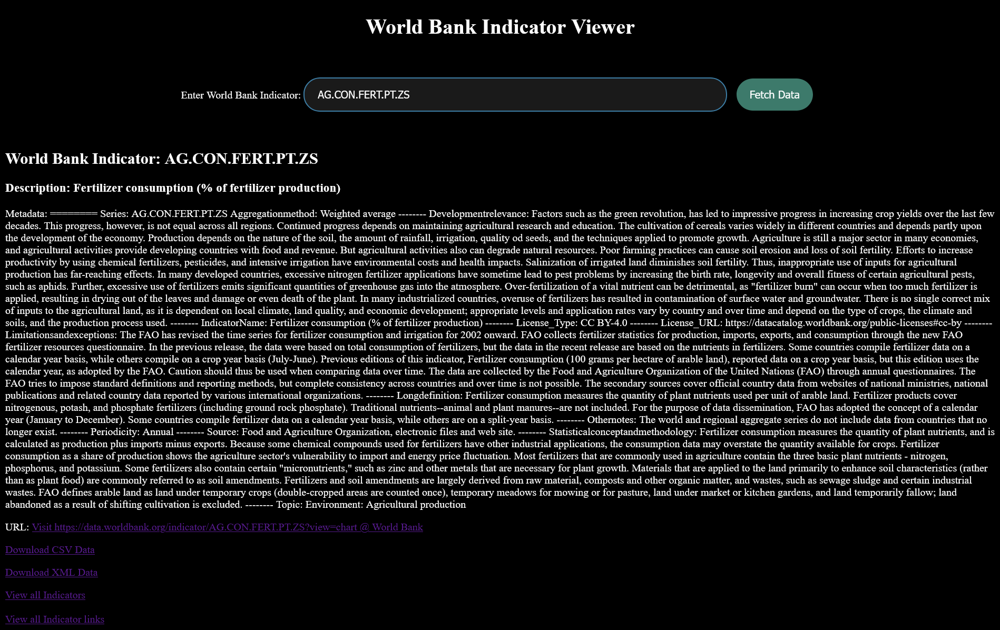

# world-bank-indicator-metadata-viewer
----------------------------------------------------------------------------------
Meatdata viewer for all world bank indicators (1488).

* Browser based.
* Place all files and metadata folder in dev server and access via localhost.
* Search by indicator returns metadata from json file to html ui via  Hidden html.
* Includes links to list of all indicator defenitions and world bank web pages.
* Auto download .xml and .csv indicator data files by clicking generated download links.

----------------------------------------------------------------------------------- 

----------------------------------------------------------------------------------
